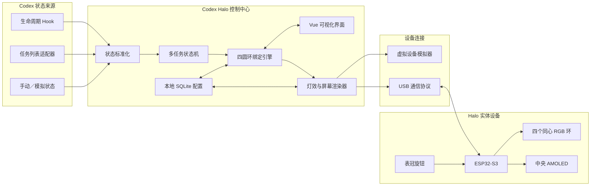

# Codex Halo 个人原型设计

**日期：** 2026-07-26  
**状态：** 已确认  
**项目代号：** `codex-halo`

## 1. 产品目标

Codex Halo 是一套用于观察 Codex 桌面应用任务状态的实体桌面设备与可视化控制中心。

设备使用四个同心 RGB 圆环表示四个不同的 Codex 任务。每一圈可独立显示执行中、等待确认、完成、失败、排队、空闲和断连等状态。中央圆形 AMOLED 屏幕可在极简图标、四任务总览和单任务详情之间切换。

第一阶段定位为个人使用的完整原型，同时保持未来产品化和跨平台扩展的可能。

## 2. 已确认的产品决策

- 实体设备采用四个同心圆环，每圈代表一个任务。
- 执行中的任务使用黄色追逐光效，形成绕圈流动的视觉效果。
- 设备直径约 180 mm，厚度目标为 28～35 mm。
- 中央使用圆形 AMOLED 屏幕。
- 右下侧约 4 点钟方向设置可按压的表冠式旋钮。
- 设备使用一根 USB-C 线完成供电和数据通信。
- Windows 版本优先，桌面软件采用跨平台架构。
- 桌面软件采用类似键盘、鼠标设备控制中心的可视化设计。
- 任务绑定采用混合模式：最活跃任务自动绑定，同时支持拖拽、锁定和交换。
- 自动绑定任务完成后绿色状态保留 5 分钟，再释放圆环。
- 第一版采用免焊模块化硬件，验证成功后再设计一体化圆形 PCB。

## 3. 第一版范围

### 3.1 包含

- Windows 桌面控制中心。
- Codex 任务状态接入技术验证。
- 四个同心圆环的软件实时预览。
- 自动绑定、手动拖拽、锁定、交换和任务等待队列。
- 灯效颜色、亮度、速度、方向和光尾长度编辑。
- 中央屏幕模式和通知行为编辑。
- 本地配置、预设和最小化事件日志。
- 系统托盘和开机启动。
- USB 设备模拟器。
- ESP32-S3 免焊硬件原型。
- 设备断线重连、状态恢复和电流限制。

### 3.2 暂不包含

- 用户账号、云同步和云端控制。
- 付费、商城或商业授权系统。
- 使用行为遥测。
- 移动端应用。
- 多台 Halo 设备联动。
- 正式量产、产品认证和商业包装。
- OpenAI 官方合作或品牌授权。

## 4. 交互与外观

### 4.1 正面

- 四个具有独立遮光结构的同心圆环。
- 中央圆形 AMOLED。
- 烟黑色或磨砂表面，使未点亮区域尽量不可见。
- 正面不放置按键，保持简洁。

### 4.2 旋钮

表冠位于设备右下侧约 4 点钟方向，建议直径 12～15 mm，露出外壳约 5 mm。

- 旋转：选择圆环、切换任务或调整当前参数。
- 短按：在图标、总览和详情之间切换。
- 双击：临时关闭通知提醒。
- 长按：返回极简图标模式。
- 选中某一圈时，对应实体圆环短暂闪白确认。

### 4.3 中央屏幕模式

1. **氛围模式**：显示极简 Codex 图标或后续自定义图标。
2. **总览模式**：显示四圈编号、任务短名称和状态。
3. **详情模式**：显示选中圆环、任务名称、状态和运行时间。
4. **通知模式**：任务完成、失败或等待确认时短暂显示通知，随后恢复原模式。

四圈从内到外固定编号为 ①、②、③、④。控制中心和实体设备使用相同编号。

## 5. 状态与灯光语言

| 标准状态 | 默认灯效 |
|---|---|
| 执行中 | 黄色光尾连续旋转 |
| 等待输入或确认 | 橙色呼吸，顶部双闪 |
| 刚刚完成 | 绿色快速绕圈一周，然后柔和常亮 |
| 执行失败 | 红色短脉冲 |
| 排队等待 | 紫色慢速旋转 |
| 普通空闲 | 极暗蓝色或关闭 |
| 状态未知或连接断开 | 蓝色慢闪 |
| 未绑定 | 关闭 |

所有颜色、亮度、速度、方向、光尾长度和状态保持时间都允许在控制中心修改并保存为预设。

## 6. 任务绑定规则

每个圆环槽位保存：

- 圆环编号。
- 任务稳定 ID。
- 任务短名称。
- 自动或手动绑定模式。
- 是否锁定。
- 当前标准状态。
- 最后活动时间。
- 状态来源和可信度。

混合模式规则：

1. 手动拖入的任务可锁定，不被自动分配覆盖。
2. 空闲、未锁定的圆环自动接收最近最活跃的任务。
3. 用户可拖拽交换两个圆环的任务。
4. 超过四个任务时，多出的任务进入等待队列。
5. 自动绑定任务完成后绿色保持 5 分钟，再释放槽位。
6. 手动锁定任务完成后不自动释放。
7. 标题重名时使用稳定任务 ID 区分。

## 7. 系统架构

## 8. 桌面控制中心

### 8.1 技术栈

- Tauri 2：桌面应用容器、托盘、开机启动、窗口和安装包。
- Vue 3 + TypeScript：界面和四圈实时预览。
- Rust：Codex 状态适配、状态机、绑定引擎和 USB 通信。
- SQLite：本地保存设备、绑定、预设和最小化事件记录。

### 8.2 主界面

- 顶部：设备连接、固件版本、全局亮度和当前预设。
- 左侧：Codex 任务列表、状态、项目和最近活动时间。
- 中间：与实体设备一致的四个同心圆实时预览。
- 右侧：选中圆环或任务的绑定和灯效属性。
- 底部：光效预设、等待队列、事件记录和设备设置。

### 8.3 设备控制中心行为

- 插入设备后自动识别和连接。
- 窗口关闭后继续在系统托盘运行。
- 修改灯效时，虚拟预览和实体设备同步变化。
- 没有实体设备时，可使用完整虚拟设备继续开发和测试。

## 9. Codex 状态接入

Codex 状态接入是项目的首要技术风险，必须在购买完整硬件前验证。

控制中心使用可替换适配器：

1. **生命周期 Hook 适配器**：接收任务开始、工具调用、等待和停止等实时事件。
2. **任务列表适配器**：周期性获取任务 ID、标题、活动时间和总体状态，用于发现与校准。
3. **手动／模拟适配器**：用于开发、演示和状态来源失效时的诊断。

状态接入不得假定现有 `claude-indicator` 草稿已经验证。新项目必须捕获真实事件并验证：

- 事件是否包含稳定任务或线程 ID。
- 两个及以上并发任务能否区分。
- 等待用户、正常结束和异常结束能否可靠区分。
- Codex 重启或更新后适配器如何恢复。

如果某个来源没有稳定任务 ID，只能作为低可信活动信号，不能覆盖手动绑定。

## 10. USB 与固件

### 10.1 通信原则

- USB-C 同时承担供电和数据。
- 消息包含协议版本、命令编号、长度、负载和校验。
- 设备对关键命令返回确认响应。
- 协议支持握手、能力查询、状态帧、配置、旋钮事件和诊断。
- 软件与固件版本不兼容时进入安全模式。

### 10.2 设备端职责

- 独立播放流畅灯光动画。
- 驱动中央 AMOLED。
- 读取旋钮旋转和按压事件。
- 实施电流与亮度限制。
- 监测通信超时和设备重启。
- 断开电脑后显示低亮待机或断连状态。

桌面软件发送高层状态和参数，不持续发送每一颗 LED 的每一帧，从而降低 USB 流量并保证动画稳定。

## 11. 硬件路线

### 11.1 第一阶段：免焊模块化原型

- ESP32-S3 开发板。
- 四个不同直径的可寻址 RGB 灯环。
- 圆形 AMOLED 模块。
- 预接线可按压旋转编码器。
- 插接式转接板和防插错线束。
- 3D 打印外壳、遮光隔离和磨砂导光件。

具体灯珠数量、屏幕型号、接口和供电器件在状态接入验证通过后确定。

### 11.2 第二阶段：一体化圆形 PCB

- 四圈高密度小型 RGB LED。
- ESP32-S3、电源管理、USB 和显示接口集成。
- 独立遮光分区。
- 面向薄型外壳和装配的一体化布局。
- 元件由 PCB 厂家贴片，用户不焊接。

## 12. 隐私与数据边界

- 不读取或上传代码内容。
- 不记录提示词或完整回复。
- 不需要用户的 OpenAI 密码或 API Key。
- 默认不启用遥测。
- 日志只保存事件类型、任务 ID、时间戳、来源和错误码。
- ESP32 只接收圆环编号、状态、灯效参数和中央屏幕需要显示的任务短名称。
- 配置和日志均保存在本机。

## 13. 异常处理

- 状态事件短暂丢失：保持当前状态，并使用任务列表校准。
- 重复或乱序事件：按任务 ID、时间戳和事件序号去重。
- 状态来源不可用：10 秒内保持最后状态，随后切换为蓝色慢闪。
- USB 断开：控制中心持续重连，设备显示断连状态。
- 控制中心重启：从 SQLite 恢复绑定，再重新查询任务。
- ESP32 重启：进入低亮安全模式，握手成功后恢复。
- 任务超过四个：进入等待队列，不覆盖锁定圆环。
- 供电不足：降低灯环亮度，优先保证屏幕、通信和旋钮。
- 协议不兼容：停止灯效更新并提示升级。

## 14. 验证策略

### 14.1 Codex 状态验证

- 捕获真实任务生命周期。
- 同时运行至少两个任务并验证任务 ID。
- 验证等待、完成、失败、重启和任务改名。

### 14.2 纯软件验证

- 使用虚拟设备测试四圈预览。
- 自动化测试状态机、绑定、锁定、交换、排队和 5 分钟释放。

### 14.3 USB 协议验证

- 使用模拟设备测试握手、断线、重连、乱序、重复、校验错误和版本不兼容。
- 验证旋钮事件反向传输。

### 14.4 免焊硬件验证

- 依次验证屏幕、旋钮和四个灯环。
- 验证遮光、颜色、动画和不同 USB 端口下的电流限制。
- 验证拔线、休眠唤醒和供电不足。

### 14.5 端到端稳定性

- 四任务并行。
- 连续运行至少 8 小时。
- 控制中心和设备异常重启恢复。
- USB 拔插恢复。
- 日志隐私检查。

## 15. 第一版验收标准

- 状态变化通常在 1 秒内反映到灯环。
- 四个任务不会串圈。
- USB 重连后自动恢复绑定。
- 控制中心后台空闲时不持续占用明显 CPU。
- 动画肉眼连续，无明显跳帧。
- 任何异常都不会让设备无限高亮或反复重启。
- 不购买完整硬件前，必须先验证 Codex 多任务身份和状态事件。

## 16. 主要风险

| 风险 | 应对 |
|---|---|
| Codex 未提供稳定的外部任务状态接口 | 适配器隔离；先做技术验证；Hook、任务列表和手动模拟互为补充 |
| Hook 事件缺少任务 ID | 不用于自动覆盖；使用任务列表校准或寻找其他稳定身份来源 |
| 单 USB 供电不足 | 动态电流限制、低亮安全模式和实机端口测试 |
| 四圈灯光串色 | 独立遮光墙、磨砂导光件和分圈亮度校准 |
| Codex 更新导致兼容性变化 | 版本化适配器、诊断页和回归用例 |
| 原型硬件模块尺寸不合适 | 状态验证通过后再锁定 BOM 和外壳尺寸 |

## 17. 下一步

1. 编写任务级实施计划。
2. 首先实现 Codex 状态捕获验证工具。
3. 验证多任务身份后实现虚拟设备和状态机。
4. 软件链路稳定后再确定免焊硬件 BOM。

