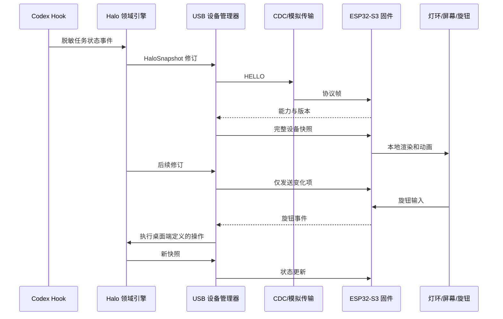

# Codex Halo USB 设备基础设计

**日期：** 2026-07-29  
**状态：** 已批准  
**阶段定位：** 在购买硬件前，冻结桌面端、USB 协议和 ESP32-S3 固件之间的边界，并用模拟设备完成可重复验证。

## 1. 目标

本阶段为 Codex Halo 建立第一条面向实体设备的可靠链路：

```text
Codex 任务状态
  → Windows 桌面驱动
  → USB CDC 串口协议
  → ESP32-S3 固件
  → 同心灯环、圆形屏幕、旋钮
```

完成后，即使没有实体硬件，也能够验证设备发现、握手、状态同步、增量更新、旋钮事件、断线重连和错误处理；固件骨架能够为选定开发板编译。达到这一条件后，再购买一套最小硬件验证组合。

本阶段不追求四圈成品、外壳或量产设计。

## 2. 已冻结的技术决策

### 2.1 控制器

首个原型使用 Waveshare ESP32-S3-Touch-AMOLED-1.43：

- ESP32-S3R8；
- 1.43 英寸、466 × 466 圆形 AMOLED；
- USB-C；
- 板载显示与触摸资源；
- 可使用 UART、I2C 和 GPIO 扩展灯环与旋钮。

首版只把屏幕用于 Halo 信息显示，不把触摸列入交付范围。

### 2.2 桌面到设备的传输

使用 USB CDC 串口与版本化二进制协议。

选择它的原因：

- Windows、macOS 和 Linux 都有成熟支持；
- 开发和诊断工具简单；
- 不需要第一版就维护自定义 USB 驱动；
- 固件与 Rust 端均易于测试；
- 将来如需迁移到 USB HID 或其他传输，协议消息仍可复用。

设备不能仅靠 COM 端口名称认定。桌面端可以使用 VID/PID 缩小候选范围，但只有成功完成协议握手和能力查询后，才能将端口识别为 Halo。

### 2.3 固件框架

使用 PlatformIO + Arduino framework。

首版优先获得成熟的板卡、屏幕和可寻址 LED 库支持。协议、状态机和硬件适配层保持独立，未来需要更严格的实时控制时，可以迁移到 ESP-IDF，而不改变桌面端领域模型。

## 3. 系统职责边界

### 3.1 桌面驱动

桌面端保留所有需要理解 Codex 任务语义的职责：

- 任务稳定身份；
- Hook 状态标准化；
- 四圈自动绑定、手动绑定、锁定、交换和等待队列；
- 灯效参数和屏幕模式配置；
- 连接发现、握手、超时、重试和重连；
- 将当前领域快照转换为设备可以理解的高层消息；
- 决定旋钮事件对应的产品行为；
- 保存诊断状态，但不记录敏感内容。

桌面端不连续发送逐像素动画帧。

### 3.2 USB 设备管理器

在现有 Rust/Tauri 后端内新增独立设备层，位于领域引擎与具体传输之间：

- `DeviceTransport` 抽象串口和模拟设备；
- 设备管理器驱动连接状态机；
- 连接成功后先握手、查询能力，再发送完整快照；
- 稳定连接期间只发送有变化的圆环、显示模式或亮度；
- 收到旋钮事件后交给桌面端解释，并将解释后的新快照发回设备；
- 对 UI 暴露稳定、脱敏的设备状态。

设备层消费 `HaloSnapshot`，但不负责修改任务绑定规则。

### 3.3 模拟设备

模拟设备与真实串口实现同一个 `DeviceTransport` 接口。它不是简单的“假在线”开关，而是协议级测试替身，需要支持：

- 正常握手与能力响应；
- ACK 和 NACK；
- 捕获完整快照与增量更新；
- 注入旋钮事件；
- 主动断开和恢复；
- 超时；
- CRC 错误；
- 协议版本不匹配。

测试使用确定性的虚拟时钟或显式推进方式，避免依赖真实休眠。

### 3.4 ESP32-S3 固件

固件负责：

- 非阻塞接收和解析二进制帧；
- 保存最近一次有效的设备呈现状态；
- 在本地播放连续灯效动画；
- 渲染中央 AMOLED；
- 读取并消抖旋钮旋转和按压；
- 上报旋钮事件和有限诊断；
- 执行本地亮度与电流上限；
- 通信超时后进入安全断连表现。

显示、灯环和旋钮分别通过板级适配接口接入。协议状态机不能直接依赖具体 GPIO 或第三方显示库。

## 4. 数据流



每次重新连接都以完整快照为权威恢复源，不能假定设备保留了断线前的正确状态。

## 5. USB CDC v0.1 协议边界

### 5.1 帧

协议采用固定头部、长度字段和 CRC 的二进制帧。具体字节布局在独立协议规范中冻结，至少包含：

- 魔数；
- 主协议版本；
- 消息类型；
- 单调递增序号；
- 负载长度；
- 有界负载；
- CRC。

解析器需要能够从噪声或半帧中重新寻找魔数，并拒绝超长负载。所有多字节整数使用统一字节序，并由共享黄金向量锁定。

### 5.2 消息族

v0.1 只实现支撑第一条完整链路的消息：

- `HELLO`；
- `CAPABILITIES`；
- `FULL_SNAPSHOT`；
- `RING_UPDATE`；
- `DISPLAY_MODE`；
- `BRIGHTNESS`；
- `HEARTBEAT`；
- `ACK`；
- `NACK`；
- `KNOB_EVENT`；
- `DIAGNOSTICS`。

关键状态写入需要 ACK。心跳和不会改变状态的诊断消息不要求形成无休止的确认往返。

### 5.3 数据最小化

设备只接收：

- 圆环编号；
- 标准化状态；
- 灯效参数；
- 屏幕模式；
- 全局亮度；
- 经过桌面端净化和截断的短标签。

协议不发送任务原始 ID、任务指纹、提示词、回答、代码、命令、工具参数、路径、环境变量或凭据。

## 6. 连接状态机

桌面 UI 使用以下稳定状态：

| 状态 | 含义 |
|---|---|
| `VIRTUAL` | 使用内置模拟设备 |
| `CONNECTING` | 正在发现、打开端口或握手 |
| `ONLINE` | 已握手并完成初始同步 |
| `INCOMPATIBLE` | 找到 Halo，但协议版本不兼容 |
| `ERROR` | 重试后仍无法建立可靠连接 |

连接流程：

1. 枚举候选端口；
2. 打开候选端口；
3. 发送 `HELLO`；
4. 验证魔数、协议版本和能力；
5. 发送完整快照；
6. 收到确认后进入 `ONLINE`；
7. 后续发送增量更新和心跳；
8. 断开或连续失败后返回发现流程。

初始阶段默认使用模拟设备，真实串口传输可以在协议与模拟器稳定后接入同一状态机。

## 7. 容错策略

- CRC 错误、NACK 或超时最多重试 2 次，随后进入重连，而不是无限重发。
- 帧长度超过上限、类型未知或载荷格式错误时直接拒绝，并返回有限诊断。
- ACK、NACK 和旋钮事件均携带序号；桌面端忽略已经处理过的旧事件。
- 固件对旋钮进行消抖，但不自行决定“选择任务”或“切换模式”等高层语义。
- 协议主版本不兼容时停止所有灯效写入，设备保持安全显示，桌面端显示 `INCOMPATIBLE`。
- 固件约 3 秒没有收到有效心跳后，短暂保留最后状态，然后切换为低亮度蓝色断连效果。
- 重连成功后，完整快照覆盖设备可能残留的旧状态。
- 固件解析器、缓冲区和字符串均使用固定上限，不能由对端声明任意内存大小。

## 8. 供电与硬件安全

### 8.1 首个硬件验证范围

第一批只连接：

- 一块 Waveshare ESP32-S3 圆屏开发板；
- 一圈约 20 颗可寻址 RGB LED；
- 一个可按压旋转编码器；
- 必需的电阻、电容、线材和限流电源。

不在第一轮同时连接四圈。

### 8.2 供电原则

- 首个原型不使用电池；
- 开发板通过 USB-C 供电和通信；
- LED 负载增加后使用独立、带限流保护的 5V 电源；
- LED 电源与开发板必须共地；
- 不从开发板 5V 引脚为最终四圈灯组供电；
- 固件提供可配置 `maxMilliAmps` 和亮度硬上限；
- 接线清单包含数据线串联电阻、主电源滤波电容、保险或限流措施；
- 上电前先测量极性、地线连续性和空载电压。

硬件 BOM 必须分别列出“一圈验证”和“未来四圈估算”，避免把原型可用错误理解为四圈供电已经验证。

## 9. 测试策略

### 9.1 协议黄金向量

仓库保存语言无关的协议向量，至少包含：

- 最小合法帧；
- 带负载帧；
- CRC 错误；
- 超长负载；
- 未知消息；
- 截断帧；
- 连续多帧和前导噪声。

Rust 编解码器和 C++ 固件解析器必须读取或等价复现同一批向量。

### 9.2 Rust 单元测试

覆盖：

- 编码和解码往返；
- CRC；
- 最大负载；
- 半帧与重新同步；
- 序号比较和旧事件拒绝；
- 能力协商；
- 主版本不兼容；
- 领域快照到设备快照的脱敏映射。

### 9.3 模拟设备集成测试

覆盖：

- 发现、握手和完整同步；
- 状态增量；
- ACK、NACK 和有界重试；
- 旋钮事件；
- 断线和重连；
- 超时；
- CRC 错误；
- 版本不匹配；
- 重连后完整快照覆盖旧状态。

### 9.4 固件测试

- 协议解析和设备状态机尽量在 PlatformIO native 环境运行主机测试；
- Waveshare 目标环境作为编译门禁；
- 硬件到手后再增加屏幕、灯环、旋钮和供电的硬件在环验证；
- 固件主循环不能使用阻塞动画或长时间延迟。

### 9.5 回归测试

现有 Rust、Vue/Vitest、TypeScript 和 Tauri 构建检查继续通过。UI 测试验证设备状态文案和错误状态，且不得破坏现有 Hook、任务绑定、拖拽和灯效编辑行为。

## 10. 本阶段交付

### 10.1 包含

1. USB CDC v0.1 协议规范；
2. Rust 协议编解码器；
3. `DeviceTransport` 抽象；
4. 确定性模拟设备；
5. 设备连接状态机与脱敏诊断状态；
6. 领域快照到设备快照的映射；
7. 桌面界面的设备连接状态；
8. Waveshare ESP32-S3 的 PlatformIO 固件骨架；
9. 固件协议解析器和硬件适配接口；
10. BOM v0.1、供电预算和接线检查清单。

### 10.2 不包含

- 四圈完整灯组；
- 成品外壳；
- 定制 PCB；
- 电池；
- 触摸交互；
- OTA；
- 自动固件升级；
- 自定义或签名 USB 驱动；
- 量产级认证；
- 最终实体屏幕和灯效验收。

## 11. 完成标准

在没有硬件的情况下：

- 模拟设备能够完成握手、完整同步和增量更新；
- 能够注入旋钮事件并观察桌面状态变化；
- 能够稳定复现超时、CRC 错误、NACK、断线重连和版本不兼容；
- 重连后设备状态与桌面权威快照一致；
- Rust 与 C++ 协议黄金向量一致；
- 固件能够为目标 Waveshare ESP32-S3 环境编译；
- 现有桌面测试和构建继续通过；
- BOM 明确第一批需要购买的最小硬件以及不可越过的供电限制。

满足这些条件后，再购买和组装最小硬件验证套件；单圈验证通过后，才扩展到四圈与结构件。
